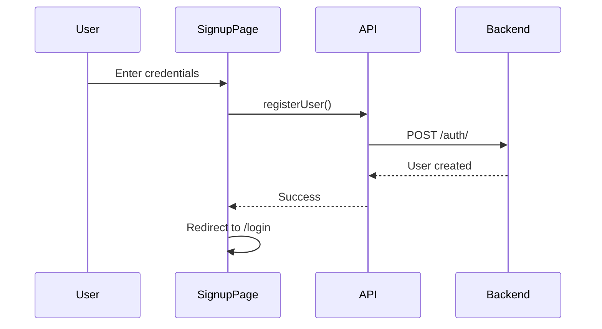
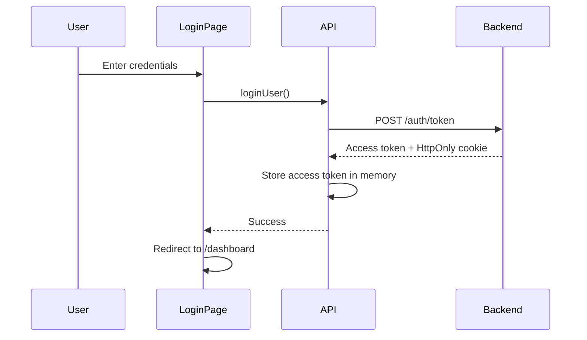
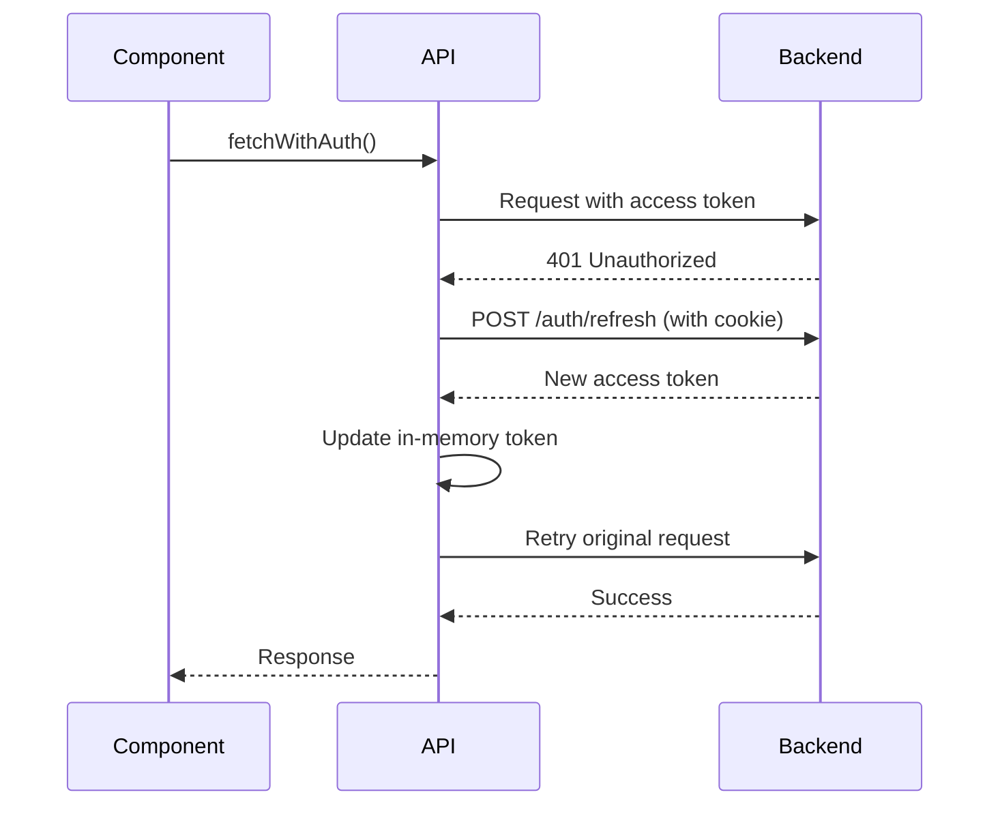
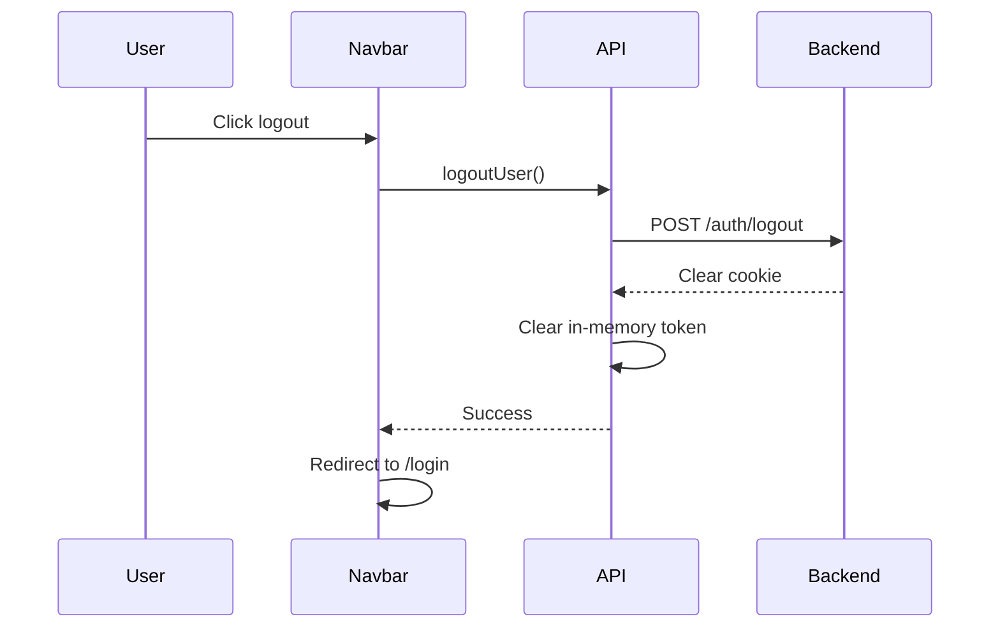

# Authentication Implementation Guide

This document provides a comprehensive overview of the authentication system implemented in the Next.js frontend application.

## Table of Contents
1. [Authentication Architecture](#authentication-architecture)
2. [File Structure](#file-structure)
3. [Core Authentication Files](#core-authentication-files)
4. [Authentication Flow](#authentication-flow)
5. [Protected Routes](#protected-routes)
6. [API Endpoints](#api-endpoints)

---

## Authentication Architecture

The authentication system uses a **JWT-based approach** with the following security features:

- **Access Token**: Stored in memory (not in localStorage) for security
- **Refresh Token**: Stored in HttpOnly cookies (secure, not accessible via JavaScript)
- **Automatic Token Refresh**: Transparently refreshes expired access tokens
- **Protected Routes**: Client-side authentication checks with redirects

### Security Benefits
- ✅ Access tokens are never persisted to localStorage (XSS protection)
- ✅ Refresh tokens are HttpOnly cookies (XSS protection)
- ✅ Automatic token refresh on 401 responses
- ✅ Centralized authentication state management

---

## File Structure

```
app/
├── (auth)/                          # Auth route group
│   ├── login/
│   │   └── page.tsx                # Login page
│   └── signup/
│       └── page.tsx                # Signup page
├── lib/
│   ├── api.ts                      # API client with auth logic
│   ├── types.ts                    # TypeScript interfaces
│   └── useAuth.tsx                 # Authentication hook
├── components/
│   └── Navbar.tsx                  # Navigation with auth state
└── dashboard/
    └── page.tsx                    # Protected dashboard page
```

---

## Core Authentication Files

### 1. [api.ts](file:///c:/Users/irfan/PycharmProjects/simple-utils/rest-apis-nextjs/app/lib/api.ts)

**Purpose**: Centralized API client with authentication logic

**Key Features**:
- In-memory access token storage
- Automatic token refresh on 401 errors
- Authenticated request wrapper (`fetchWithAuth`)

**Key Functions**:

#### `setAccessToken(token: string)`
Stores the access token in memory.

#### `getAccessToken()`
Retrieves the current access token from memory.

#### `fetchWithAuth(url: string, options: RequestInit)`
Wrapper for authenticated API requests with automatic retry logic:
1. Checks if access token exists, attempts refresh if not
2. Makes request with Authorization header
3. If 401 response, refreshes token and retries request
4. Throws error if refresh fails

#### `refreshAuth()`
Refreshes the access token using the refresh token stored in HttpOnly cookie:
```typescript
const res = await fetch(`${API_URL}/auth/refresh`, {
  method: "POST",
  credentials: "include" // Sends HttpOnly cookie
});
```

#### `loginUser(user: CreateUserRequest)`
Authenticates user and stores access token:
```typescript
const res = await fetch(`${API_URL}/auth/token`, {
  method: "POST",
  headers: { "Content-Type": "application/x-www-form-urlencoded" },
  body: formData,
  credentials: "include" // Receives HttpOnly cookie
});
```

#### `logoutUser()`
Logs out user and clears tokens:
```typescript
await fetch(`${API_URL}/auth/logout`, {
  method: "POST",
  credentials: "include"
});
setAccessToken(''); // Clear in-memory token
```

#### `registerUser(user: CreateUserRequest)`
Creates a new user account.

#### `createBlog(blog: CreateBlogRequest)`
Protected endpoint - creates a blog post (requires authentication).

---

### 2. [useAuth.tsx](file:///c:/Users/irfan/PycharmProjects/simple-utils/rest-apis-nextjs/app/lib/useAuth.tsx)

**Purpose**: Custom React hook for managing authentication state

**Returns**:
- `isLoggedIn`: Boolean indicating if user is authenticated
- `isLoading`: Boolean indicating if auth check is in progress

**Usage**:
```typescript
const { isLoggedIn, isLoading } = useAuth();
```

**How it works**:
1. On mount, attempts to refresh the access token
2. If successful, sets `isLoggedIn = true`
3. If failed, sets `isLoggedIn = false`
4. Sets `isLoading = false` when check completes

---

### 3. [types.ts](file:///c:/Users/irfan/PycharmProjects/simple-utils/rest-apis-nextjs/app/lib/types.ts)

**Purpose**: TypeScript type definitions

**Interfaces**:

```typescript
interface Token {
  access_token: string;
  token_type: string;
}

interface CreateUserRequest {
  username: string;
  password: string;
}

interface Blog {
  id: number;
  title: string;
  content: string;
  slug: string;
  published: boolean;
  created_at: string;
  owner_id: number;
}

interface CreateBlogRequest {
  title: string;
  content: string;
  published?: boolean;
}
```

---

## Authentication Flow

### Registration Flow



**Files involved**:
- [signup/page.tsx](file:///c:/Users/irfan/PycharmProjects/simple-utils/rest-apis-nextjs/app/(auth)/signup/page.tsx)
- [api.ts](file:///c:/Users/irfan/PycharmProjects/simple-utils/rest-apis-nextjs/app/lib/api.ts) - `registerUser()`

---

### Login Flow



**Files involved**:
- [login/page.tsx](file:///c:/Users/irfan/PycharmProjects/simple-utils/rest-apis-nextjs/app/(auth)/login/page.tsx)
- [api.ts](file:///c:/Users/irfan/PycharmProjects/simple-utils/rest-apis-nextjs/app/lib/api.ts) - `loginUser()`

---

### Token Refresh Flow



**Files involved**:
- [api.ts](file:///c:/Users/irfan/PycharmProjects/simple-utils/rest-apis-nextjs/app/lib/api.ts) - `fetchWithAuth()`, `refreshAuth()`

---

### Logout Flow



**Files involved**:
- [Navbar.tsx](file:///c:/Users/irfan/PycharmProjects/simple-utils/rest-apis-nextjs/app/components/Navbar.tsx)
- [api.ts](file:///c:/Users/irfan/PycharmProjects/simple-utils/rest-apis-nextjs/app/lib/api.ts) - `logoutUser()`

---

## Protected Routes

### Dashboard Page

**File**: [dashboard/page.tsx](file:///c:/Users/irfan/PycharmProjects/simple-utils/rest-apis-nextjs/app/dashboard/page.tsx)

**Protection Strategy**:
1. Uses `useAuth()` hook to check authentication
2. Shows loading spinner while checking auth
3. Redirects to `/login` if not authenticated
4. Only renders dashboard content when authenticated

**Implementation**:
```typescript
const { isLoggedIn, isLoading } = useAuth();

useEffect(() => {
  if (!isLoading && !isLoggedIn) {
    router.push('/login');
  }
}, [isLoggedIn, isLoading, router]);

if (isLoading) {
  return <LoadingSpinner />;
}

if (!isLoggedIn) {
  return null; // Will redirect
}

return <DashboardContent />;
```

---

## API Endpoints

### Backend Endpoints Used

| Endpoint | Method | Purpose | Auth Required | Cookie Sent |
|----------|--------|---------|---------------|-------------|
| `/auth/` | POST | Register new user | ❌ | ❌ |
| `/auth/token` | POST | Login (get tokens) | ❌ | ✅ (receives) |
| `/auth/refresh` | POST | Refresh access token | ❌ | ✅ (sends) |
| `/auth/logout` | POST | Logout (clear cookie) | ❌ | ✅ (sends) |
| `/blogs` | GET | Get all blogs | ❌ | ❌ |
| `/blogs/{id}` | GET | Get blog by ID | ❌ | ❌ |
| `/blogs` | POST | Create blog | ✅ | ❌ |

---

## Component-Level Authentication

### Navbar Component

**File**: [Navbar.tsx](file:///c:/Users/irfan/PycharmProjects/simple-utils/rest-apis-nextjs/app/components/Navbar.tsx)

**Features**:
- Displays login/logout button based on auth state
- Uses `useAuth()` hook to check authentication on mount
- Handles logout with redirect to login page

**Key Code**:
```typescript
const { isLoggedIn } = useAuth();

{isLoggedIn ? (
  <button onClick={handleLogout}>Logout</button>
) : (
  <Link href="/login">Login</Link>
)}
```

---

## Best Practices Implemented

### ✅ Security
- Access tokens stored in memory (not localStorage)
- Refresh tokens in HttpOnly cookies
- CSRF protection via SameSite cookies
- Automatic token refresh

### ✅ User Experience
- Loading states during auth checks
- Automatic redirects for protected routes
- Seamless token refresh (no user interruption)
- Clear error messages

### ✅ Code Organization
- Centralized API client
- Reusable authentication hook
- Type-safe with TypeScript
- Separation of concerns

---

## Adding Authentication to New Pages

To protect a new page, follow this pattern:

```typescript
'use client';

import { useEffect } from 'react';
import { useRouter } from 'next/navigation';
import { useAuth } from '../lib/useAuth';

export default function ProtectedPage() {
  const router = useRouter();
  const { isLoggedIn, isLoading } = useAuth();

  useEffect(() => {
    if (!isLoading && !isLoggedIn) {
      router.push('/login');
    }
  }, [isLoggedIn, isLoading, router]);

  if (isLoading) {
    return <div>Loading...</div>;
  }

  if (!isLoggedIn) {
    return null;
  }

  return <div>Protected Content</div>;
}
```

---

## Making Authenticated API Calls

To make authenticated requests to new endpoints:

```typescript
import { fetchWithAuth } from '../lib/api';

// Example: Delete a blog post
export async function deleteBlog(id: number) {
  const res = await fetchWithAuth(`/blogs/${id}`, {
    method: 'DELETE'
  });
  
  if (!res.ok) {
    throw new Error('Failed to delete blog');
  }
  
  return res.json();
}
```

The `fetchWithAuth` wrapper automatically:
- Adds Authorization header
- Handles token refresh on 401
- Retries failed requests after refresh

---

## Troubleshooting

### Issue: "Authentication session expired" error

**Cause**: Refresh token has expired or is invalid

**Solution**: User needs to log in again

---

### Issue: Dashboard accessible without login

**Cause**: Missing authentication check in page component

**Solution**: Add `useAuth()` hook and redirect logic (see [Protected Routes](#protected-routes))

---

### Issue: 401 errors on API calls

**Cause**: Access token expired and refresh failed

**Solution**: 
1. Check if backend `/auth/refresh` endpoint is working
2. Verify HttpOnly cookie is being sent (`credentials: "include"`)
3. Check browser console for CORS errors

---

## Summary

This authentication system provides a secure, user-friendly way to manage user sessions in the Next.js application. The key files to modify for auth-related changes are:

1. **[api.ts](file:///c:/Users/irfan/PycharmProjects/simple-utils/rest-apis-nextjs/app/lib/api.ts)** - Add new authenticated API calls
2. **[useAuth.tsx](file:///c:/Users/irfan/PycharmProjects/simple-utils/rest-apis-nextjs/app/lib/useAuth.tsx)** - Modify auth state logic
3. **[types.ts](file:///c:/Users/irfan/PycharmProjects/simple-utils/rest-apis-nextjs/app/lib/types.ts)** - Add new type definitions
4. **Page components** - Add authentication protection using `useAuth()`
